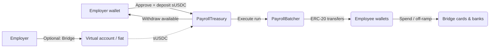

Axios runs on **Somnia**. Employers fund payroll from **sUSDC** held in **PayrollTreasury**; the **PayrollBatcher** releases funds to employee wallets; optional Bridge rails and cards sit on top.

## Employer funding

Primary path today: connect an **employer admin** wallet, **approve** sUSDC, and **deposit** into `PayrollTreasury`. The contract keys balances by `keccak256(abi.encodePacked(msg.sender))` for the depositing address.

Employers can **withdraw** any **available** (non-locked) balance back to the same wallet via `withdraw(uint256)` on the treasury contract.

## PayrollTreasury

Holds per-employer **available**, **locked** (in-flight payroll), and **gas budget** accounting. Only **available** balance can be withdrawn; locked funds settle when the batch completes or unlock on failure.

## PayrollBatcher

Coordinates batch payroll: locks funds, transfers sUSDC to employees, and attaches memo metadata for compliance and reconciliation.

## Employee wallets and Bridge

Employees receive salary at on-chain addresses. Bridge integrations can provide cards and off-ramp where configured.
