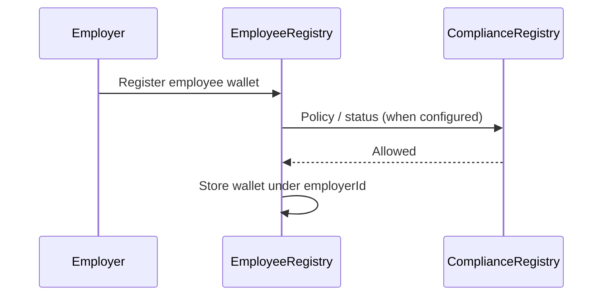

The `EmployeeRegistry` contract links employer IDs to **employee wallet addresses** on **Somnia**, with optional checks against the **`ComplianceRegistry`** contract (policy IDs per employer).

## Registration

When an employer adds an employee, the wallet can be registered on-chain subject to **`ComplianceRegistry`** rules (e.g. allow/block lists) for the configured policy.

## Data mapping

The registry stores:
- `wallet`: The **Somnia** `0x…` receiving address.
- `employerId`: The entity authorizing and funding the payroll batches.
- `employeeIdHash`: An encrypted hash mapping directly back to the employee's Personally Identifiable Information in the secure off-chain Supabase database.
- `active`: A boolean toggling whether the employee is eligible and active for the upcoming batch run.

By segregating compliance state and public wallet connections from sensitive PII, Axios maintains bank-grade security without compromising its on-chain operational efficiency.
