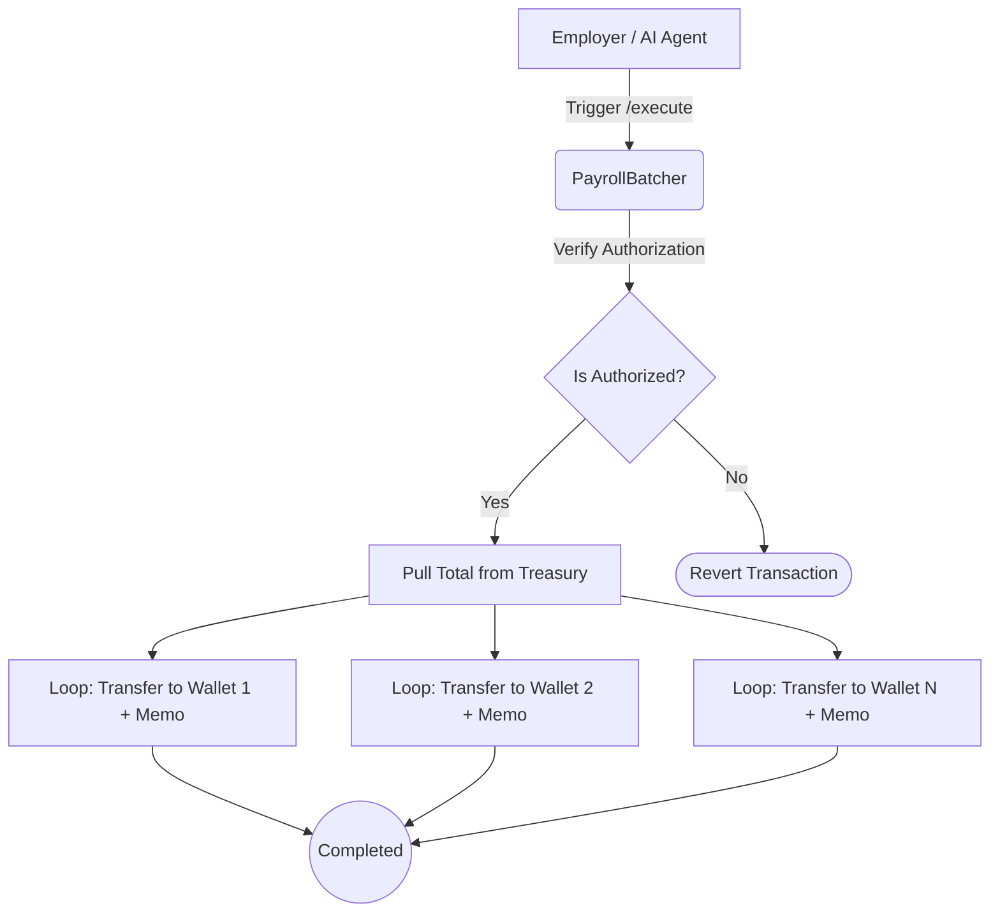

The `PayrollBatcher` handles the transactional heavy lifting when an employer processes a periodic payroll cycle for their entire team on **Somnia testnet**.

It coordinates bulk **sUSDC** transfers in one flow: lock funds in **PayrollTreasury**, pay each recipient, and attach **32-byte memos** for reconciliation.

## Execution Flow and Parameters

When triggered (either manually via the dashboard or programmatically by an AI agent through AgentCash), the batcher's primary execution function `executeBatchPayroll` receives three critical arrays arrays matching the workforce index:

1. `recipients`: An array containing every receiving employee's on-chain wallet address.
2. `amounts`: The exact stablecoin amount each employee is owed for the given cycle.
3. `memos`: A matching array of 32-byte payloads for each transfer.

The contract loops through the arrays to issue **ERC-20** sUSDC transfers from the treasury’s locked balance. Gas and finality follow **Somnia** network behavior on testnet.

### Agent Authorization Boundaries

Because the batcher directly interfaces with the `PayrollTreasury` to disburse capital, the `executeBatchPayroll` method is locked behind strict access controls. 

If an AI agent calls the executor autonomously via the MPP endpoint (`/api/mpp/payroll/execute`), the smart contract verifies the session's validity, the agent's pre-approved spending keys, and the `lockedBalance` state inside the treasury before the batcher is allowed to move a single cent.
